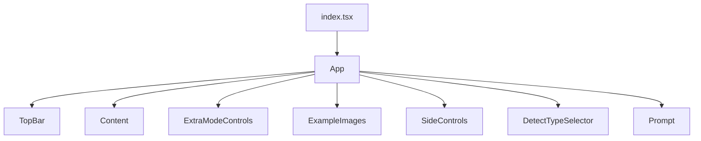

# Architecture Snapshot Before Session 1

This diagram represents the structure of the TypeScript React application before modifications.

```mermaid
graph TD
    index.tsx --> App[App]
    App --> TopBar
    App --> Content
    App --> ExtraModeControls
    App --> ExampleImages
    App --> SideControls
    App --> DetectTypeSelector
    App --> Prompt
```
