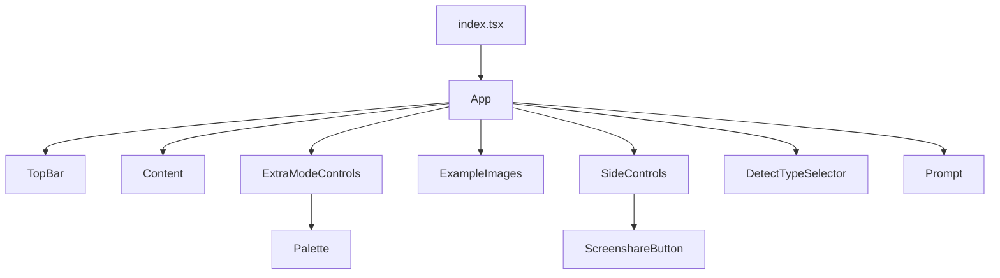

# Architecture Snapshot After Session 2

No structural changes were introduced during this session. The application modules remain connected as before.

```mermaid
graph TD
    index.tsx --> App[App]
    App --> TopBar
    App --> Content
    App --> ExtraModeControls
    App --> ExampleImages
    App --> SideControls
    App --> DetectTypeSelector
    App --> Prompt
    SideControls --> ScreenshareButton
    ExtraModeControls --> Palette
```
