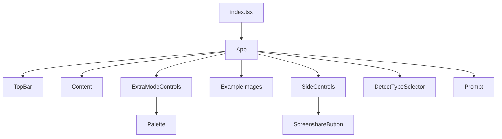

# Architecture Snapshot Before Session 2

This diagram reflects the structure of the React application prior to modifications in this session.

```mermaid
graph TD
    index.tsx --> App[App]
    App --> TopBar
    App --> Content
    App --> ExtraModeControls
    App --> ExampleImages
    App --> SideControls
    App --> DetectTypeSelector
    App --> Prompt
    SideControls --> ScreenshareButton
    ExtraModeControls --> Palette
```
