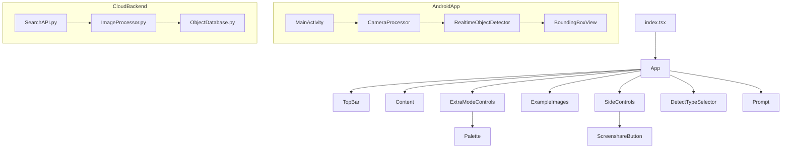

# Architecture Snapshot After Session 3

Merging the latest changes from `master` did not introduce new modules. The overall structure remains consistent with the previous snapshot.

```mermaid
graph TD
    index.tsx --> App[App]
    App --> TopBar
    App --> Content
    App --> ExtraModeControls
    App --> ExampleImages
    App --> SideControls
    App --> DetectTypeSelector
    App --> Prompt
    SideControls --> ScreenshareButton
    ExtraModeControls --> Palette

    subgraph AndroidApp
        MainActivity --> CameraProcessor
        CameraProcessor --> RealtimeObjectDetector
        RealtimeObjectDetector --> BoundingBoxView
    end

    subgraph CloudBackend
        SearchAPI.py --> ImageProcessor.py
        ImageProcessor.py --> ObjectDatabase.py
    end
```
