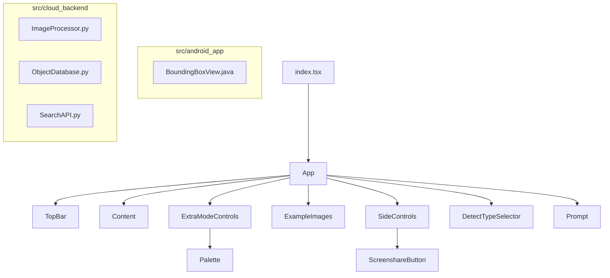

# Architecture Snapshot After Session 3

No code changes were required for the merge. The architecture of the application remains consistent with the previous snapshot.

```mermaid
graph TD
    index.tsx --> App[App]
    App --> TopBar
    App --> Content
    App --> ExtraModeControls
    App --> ExampleImages
    App --> SideControls
    App --> DetectTypeSelector
    App --> Prompt
    SideControls --> ScreenshareButton
    ExtraModeControls --> Palette
    subgraph src/android_app
        BoundingBoxView.java
    end
    subgraph src/cloud_backend
        ImageProcessor.py
        ObjectDatabase.py
        SearchAPI.py
    end
```
