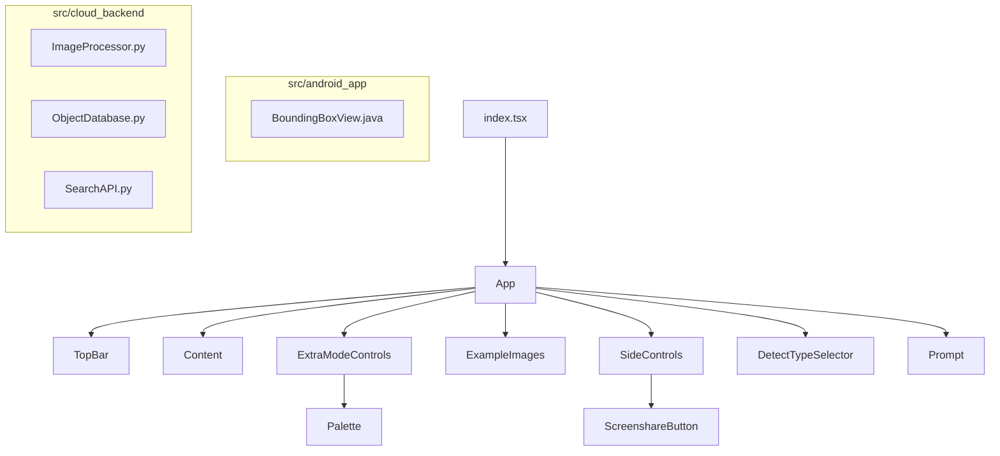

# Architecture Snapshot Before Session 3

The project structure before merging branches remains unchanged from the previous session. The application includes React components, placeholder Android app files, and cloud backend modules.

