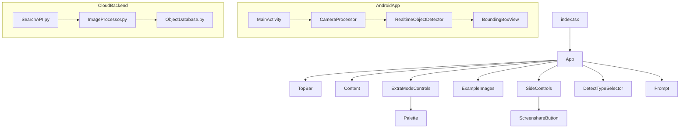

# Architecture Snapshot Before Session 3

This diagram captures the structure of the React web application together with new Android and cloud backend modules present before merging updates from `master`.

